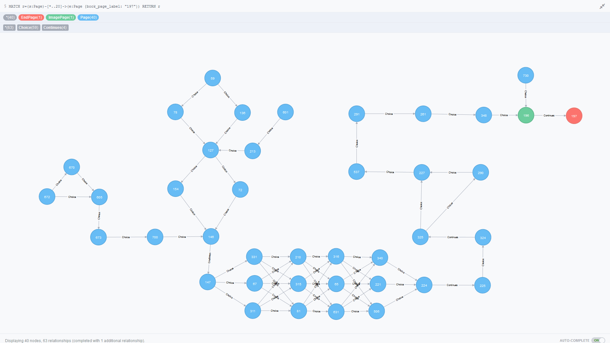
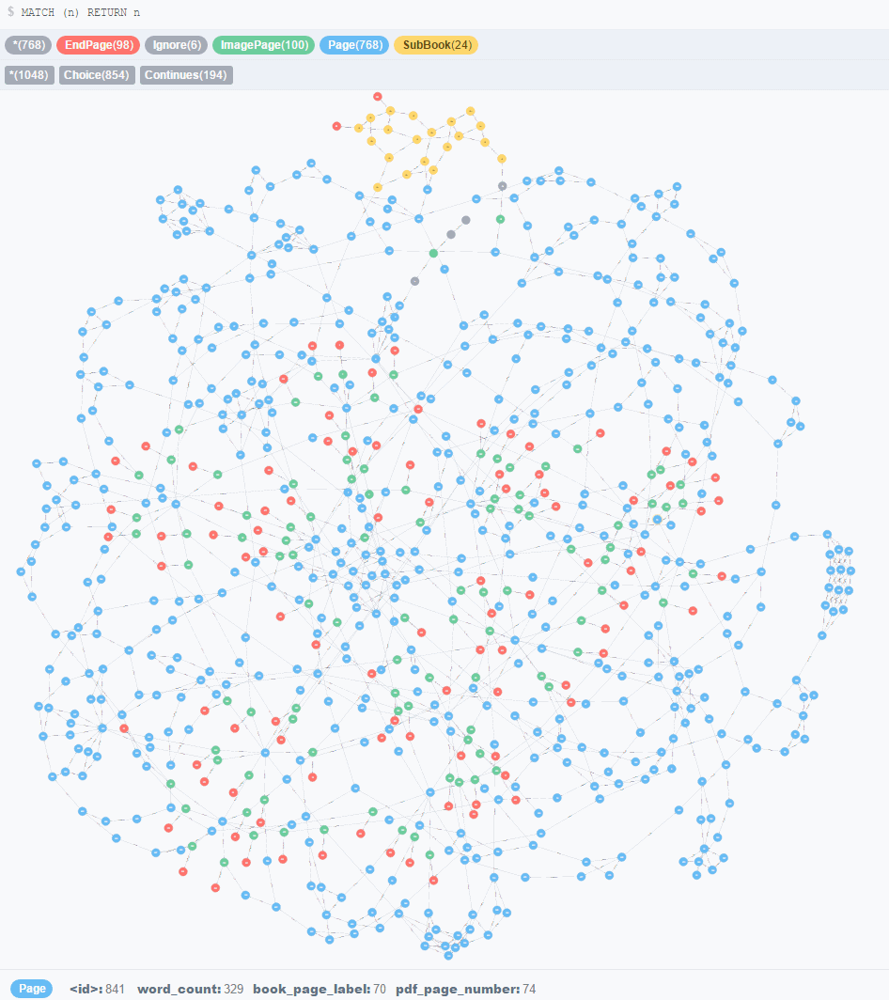

# Adventurer
This is a program written to analyse choose your own adventure books.

More specifically [To Be Or Not To Be](https://www.kickstarter.com/projects/breadpig/to-be-or-not-to-be-that-is-the-adventure/), by [Ryan North](https://twitter.com/ryanqnorth).
I claim no ownership of his most excellent book and **I won't be including the PDF version in this repository**. You can however buy his book in paper form here: [http://breadpig.com/products/to-be-or-not-to-be](http://breadpig.com/products/to-be-or-not-to-be)

The original Kickstarter offered a poster visualising a graph of all the routes through the book, [which you can still buy](http://breadpig.com/products/to-be-or-not-to-be), but I wanted more than a paper-based graph.

Adventurer results in a [Neo4j](http://neo4j.com/) database filled with information parsed out of the PDF. With that you can query all the routes you could take to get from one page to another, routes to end pages, and more!

Some might say this takes the fun out of a choose your own adventure book, and it kind of does. But some days you just want to end up being Hamlet riding Claudius like a skateboard after being fired out of a cannon from the rad pirate ship you took control of after fighting the pirate captain (check out page 348, it's rad).

## Example
Once the code has run and analysed the book you can start Neo4j in the graph-db directory and start querying the data with [Cypher](http://neo4j.com/developer/cypher/) (Neo4j’s graph query language).

You can then query out the full graph of pages that make up the sub-book (The Murder of Gonzago):

Cypher = `MATCH (n:SubBook) RETURN n`

Here's some of the route that ends up at my favourite ending, page 197 (The fight with the pirate captain is at the bottom with multiple routes as you choose how to swashbuckle):

Cypher = `MATCH r=(s:Page)-[*..20]->(e:Page {book_page_label: "197"}) RETURN r`

You can also view the whole book in graph form, though this can take some time to render nicely:

Cypher = `MATCH (n) RETURN n`

## Requirements
Adventurer is written in Java (1.8+) with Maven for dependency management. You will need [Neo4j Community Edition](http://neo4j.com/download/)

You will need to supply your own PDF version of **To Be Or Not To Be** however. Everyone who backed the project on [Kickstarter](https://www.kickstarter.com/) should have received a copy. I'm not sure if you can buy a PDF copy today, but [I would highly suggest buying a legit paper copy](http://breadpig.com/products/to-be-or-not-to-be) before heading to Google looking for a less legit copy. This project can help you enjoy the book more, and the book is well worth the money!

Put your copy of `tbontb-regular.pdf` in a folder called resources and you should be good to go.

## TODO
- Improve page parsing for end/image pages
- Attempt to work back from links to find the choice text to add to relationships
- Write queries to get the long route or quick routes based on word-count weighted relationships
- Consolidate page parse loops?
- Research indexing in Neo4J to improve performance
